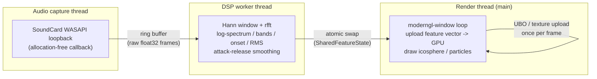

# audio_reactive_3d

A real-time, GPU-rendered 3D visualizer that reacts to whatever audio is
currently playing on your computer — Spotify, a game, a YouTube tab,
anything going out your speakers. No microphone, no manual beat-mapping:
system-audio loopback is captured, analyzed with a classic FFT-based DSP
pipeline (log-frequency spectrum, band energies, onset/beat detection), and
fed straight into raw GLSL shaders driving an icosphere and a particle
field, all running at a steady 60 fps with sub-30ms end-to-end latency.


> **TODO:** record a demo GIF of the app running against real music and
> drop it at `docs/demo.gif`. Suggested capture command (Windows, after
> recording a screen capture to `demo.mp4`):
>
> ```sh
> ffmpeg -i demo.mp4 -vf "fps=20,scale=960:-1:flags=lanczos" -loop 0 docs/demo.gif
> ```

## Install & run

This project uses [uv](https://docs.astral.sh/uv/) for dependency
management — no `requirements.txt`, no manual virtualenv juggling.

### Windows (primary target — WASAPI loopback)

```powershell
# Install uv if you don't have it yet:
irm https://astral.sh/uv/install.ps1 | iex

# From the repo root:
uv sync

# List capturable output (loopback) devices:
uv run python -m audio_reactive_3d.main --list-devices

# Run the visualizer (captures the default output device):
uv run python -m audio_reactive_3d.main
```

Press **1** / **2** to switch visual modes, **Esc** to quit.

### No dedicated GPU? Use `--low-power`

The icosphere mode (`1`) renders a ~2.5k-vertex mesh with 4x MSAA and a
full-screen lighting shader — cheap on real GPU hardware, but expensive on
a *software* OpenGL rasterizer (e.g. Mesa llvmpipe on Linux, or Windows'
"Microsoft Basic Render Driver" / WARP fallback when there's no GPU
driver). On those renderers it can drop to a crawl and look frozen, while
the particle mode (`2`) — much cheaper per-pixel — keeps animating
normally. If that's what you're seeing, run with `--low-power`:

```sh
uv run python -m audio_reactive_3d.main --low-power
```

This disables MSAA, shrinks the window to 854x480, uses a much lower-poly
icosphere (subdivision level 2, 162 verts / 320 tris instead of 2562 /
5120), and uses fewer particles (768 instead of 2048) — all to keep
per-pixel and per-vertex cost low enough for a software rasterizer to hit a
usable frame rate. The app also passively checks the reported `GL_RENDERER`
string at startup and logs a suggestion to try `--low-power` if it looks
like a software renderer, win or lose.

### Linux (PulseAudio/PipeWire monitor source)

`SoundCard` loopback-captures via the default sink's **monitor** source, so
no extra driver is needed if you're on PulseAudio or PipeWire (with its
Pulse-compatible shim). Same commands as above. If no monitor source is
found, the app logs a clear error instead of crashing.

### macOS (needs a loopback driver)

macOS has no built-in output loopback; install
[BlackHole](https://github.com/ExistentialAudio/BlackHole) (or Soundflower)
and set it as a Multi-Output Device so you can still hear audio while it's
captured. Same commands as above, passing `--device` if you need to select
the BlackHole device explicitly:

```sh
uv run python -m audio_reactive_3d.main --device BlackHole
```

### Headless / no-GPU environments

```sh
uv run python -m audio_reactive_3d.main --headless --log-features
```

Runs just the audio capture + DSP pipeline and logs the extracted feature
vector to the console — no GL context is created, so this works in CI or
any environment without a display/GPU.

### Running the tests

```sh
uv run pytest -q
uv run ruff check .
```

## Architecture

Single process, three threads connected by a lock-free, numpy-backed ring
buffer. The audio callback never does DSP; the DSP worker never touches the
GPU; the render loop never blocks on audio, so a slow or stalled DSP tick
can't drop the frame rate below 60 fps.



- **Audio capture thread** (`audio/capture.py`): opens a `SoundCard`
  loopback stream on the default (or named) output device and pushes raw
  float32 frames into a preallocated `RingBuffer` (`audio/ring_buffer.py`).
  Zero DSP, zero heap allocation per callback.
- **DSP worker thread** (`audio/dsp_worker.py`, `audio/features.py`,
  `audio/smoother.py`): pulls fixed-size blocks from the ring buffer,
  windows + FFTs them, derives the feature vector below, applies
  attack/release smoothing, and publishes the result via a single
  atomically-swapped reference (`SharedFeatureState`) — never a lock the
  render loop could block on.
- **Render thread** (`render/app.py`, `render/scene.py`,
  `render/particles.py`): the `moderngl-window` main loop (main thread)
  reads the latest published feature vector once per frame, uploads it to
  the GPU (a std140 uniform buffer for the icosphere's four scalar bands, a
  small float texture for the particle field's per-particle dynamic bin
  lookups), and draws. Vsync paces the loop — no `time.sleep`-based timing
  anywhere in the render path.

## Feature vector layout

Every DSP tick publishes one 128-float vector (padded for GPU alignment);
see the docstring in `audio/features.py` for the authoritative version.

| Index     | Meaning                                   | Range  |
|-----------|--------------------------------------------|--------|
| `0:64`    | Log-spaced magnitude spectrum, dB-scaled   | 0.0–1.0 |
| `64`      | Low band energy (20–250 Hz)                | 0.0–1.0 |
| `65`      | Mid band energy (250–2000 Hz)              | 0.0–1.0 |
| `66`      | High band energy (2000–16000 Hz)           | 0.0–1.0 |
| `67`      | RMS level (dB-scaled)                      | 0.0–1.0 |
| `68`      | Onset/beat flag                            | 0.0 or 1.0 |
| `69`      | Smoothed BPM estimate (0 if unknown)        | 60–200 or 0.0 |
| `70:128`  | Reserved (always 0.0)                      | —      |

## Visual modes

| Key | Mode | Description |
|-----|------|-------------|
| `1` | Icosphere | A procedurally-generated ~2.5k-vertex icosphere, displaced along its normals by the low-band energy and colored by mid/high-band energy + a Fresnel rim light. |
| `2` | Particles | 2048 particles spread evenly over a sphere (Fibonacci lattice), each bound to one of the 64 spectrum bins, pushed outward and colored by that bin's live energy — reads as a spherical spectrum analyzer. |

Shaders hot-reload: edit any `.glsl`/`.vert`/`.frag` file under
`src/audio_reactive_3d/render/shaders/` while the app is running and it
recompiles automatically (falling back to the last good program if the
edit doesn't compile, so a typo never crashes the app).

## What I learned

- **Threading boundaries matter more than the DSP math.** The hardest part
  of this project wasn't the FFT or the GLSL — it was making sure the
  audio callback, DSP thread, and render loop could never block each
  other. A single atomically-swapped "latest feature frame" reference
  turned out to be simpler and safer than a mutex-guarded struct.
- **std140 uniform buffer layout rules are unforgiving but learnable.** A
  `vec4[]` array has a clean, padding-free 16-byte stride, which meant a
  raw `float32[128]` numpy array could be uploaded to the GPU with zero
  repacking — but a `float[]` array of the same data would have needed 4x
  the space due to std140's per-scalar padding rules.
- **Not everything with per-element lookups can live in a uniform buffer.**
  The particle mode needed a *dynamically* indexed per-vertex lookup (each
  particle reads a different, runtime-chosen spectrum bin), which isn't
  portably supported for UBO arrays — switching to a small float texture
  sampled with `texelFetch` solved it cleanly.
- **A dark color times a dim light is still dark.** An early version of the
  icosphere shader was barely visible against the background because it
  multiplied an already-dark base color by a 0–1 lighting factor, capping
  brightness far below what it looked like it should. Lesson: light
  *intensity* and base *color* need to be tuned together, not independently.
- **Offscreen rendering is a surprisingly powerful verification tool.**
  Rendering into a `moderngl` standalone context and asserting on pixel
  values (mean brightness, nonzero pixel counts) caught real bugs — and
  once, almost caused a false one, when a test forgot to clear the depth
  buffer before rendering and produced an all-black frame that looked like
  a shader failure but was actually an uninitialized-framebuffer bug in the
  test itself.

## Project layout

```
src/audio_reactive_3d/
├── main.py                # entry point, wires everything together
├── config.py               # every tunable constant, in one place
├── audio/
│   ├── capture.py          # SoundCard loopback + ring buffer writer
│   ├── ring_buffer.py      # lock-free numpy-backed ring buffer
│   ├── features.py         # FFT, log-spectrum, bands, onset, BPM
│   ├── smoother.py         # attack/release ballistics
│   └── dsp_worker.py       # background thread wiring the above together
└── render/
    ├── app.py              # moderngl-window App: mode toggle, overlay, reload
    ├── scene.py            # icosphere mesh + UBO-driven shader
    ├── particles.py        # particle field + texture-driven shader
    ├── geometry.py          # procedural icosphere + Fibonacci sphere
    ├── shader_reload.py     # GLSL hot-reload helper
    └── shaders/             # basic.{vert,frag}, particles.{vert,frag}
```

## License

MIT — see [`LICENSE`](LICENSE).